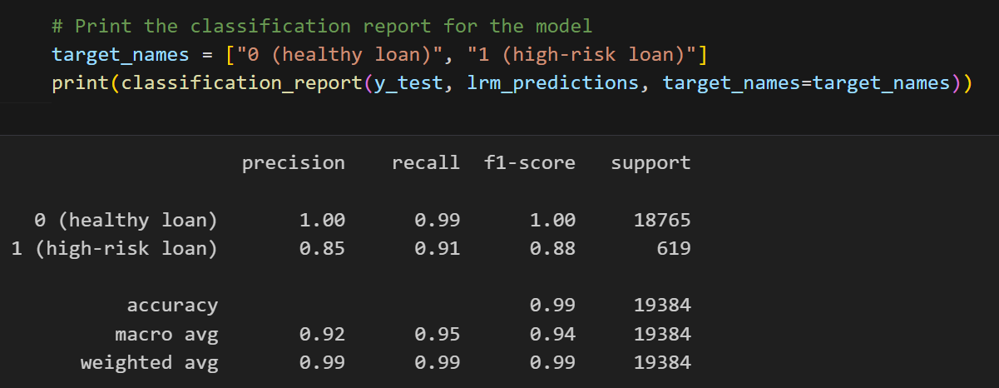
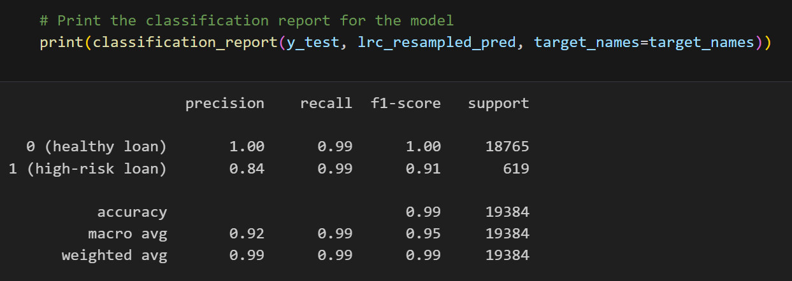

# Overview of the Analysis 
* Credit risk is important because it directly impacts the financial health of institutions. Thus, effective management of credit risk is essential for sustainable lending practices and overall financial well-being.

* In this challenge, historical lending data was utilized for training and testing to assess a model's performance in predicting loan risk. To evaluate the model, both the original data and resampled training data were employed.

# Comparison of Results between Original and Resampled Data
< Logistic Regression Model fitted with Original (Imbalanced) Data >

< Logistic Regression Model fitted with Resampled (oversampled) Data >

* Accuracy score: The score increased from 95% to 99% when the resampled data was used.
* Precision score: For healthy loans (0), there was no change in the score, while for high-risk loans (1), there was a marginal 0.01% decrease. 
* Recall score: The recall score for high-risk loans (1) saw a significant improvement, whereas the recall score for healthy loans (0) remained unchanged with the resampled data model.

# Summary
I suggest using this model for the company, because this model significantly increased the high-risk loan's recall score from 0.91 to 0.99 when the resampled (oversampled) model was used. For high-risk loans, it's important to maximize the recall score, which means catching as many true high-risk loans as possible, while precision focuses on minimizing the mistakes of labeling safe loans as high-risk.